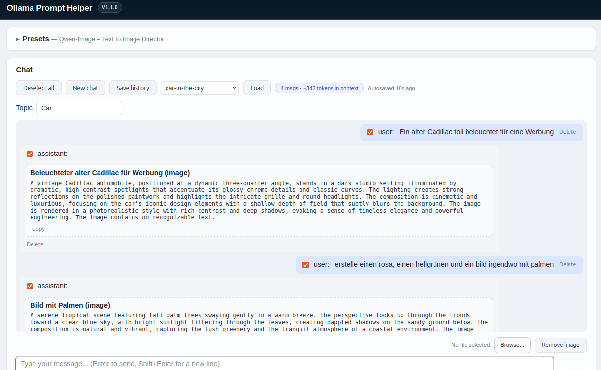

# AI-OllamaPromptHelper
Simple Web based UI which uses Ollama to support in Prompt generation

Vibe Coded 

## Features

**AI-OllamaPromptHelper** turns your local [Ollama](https://ollama.com) instance into a full-blown **prompt engineering workshop** — chat your way to better prompts, then reuse them anywhere.

* **Chat-based prompt workshop** — iteratively refine prompts for image, video and text generators through a natural conversation with your local LLM
* **Fully editable presets** — switch, create and edit system prompt / model / tuning presets right from the UI, no config file editing required
* **Multimodal input** — attach images to your messages for vision-capable models
* **Visible "thinking"** — reasoning output is shown separately from the final answer when a model supports it
* **Fine-grained context control** — check/uncheck individual messages to control exactly what's sent to the model, with a live context-size indicator
* **Automatic prompt extraction** — recognized prompts are pulled out of the conversation and collected into per-topic Markdown libraries, ready to copy with one click
* **Autosave & manual save/load** — never lose a chat session, with undo for accidental deletions
* **Local-first & private** — everything runs on your machine (or your own server); no data leaves your network unless you point it at a remote Ollama instance
* **Ready-to-run container image** — pull it from GHCR and get going with Docker/Podman/Docker Compose in minutes





## Best Practices

* **Treat presets as suggestions** — adjust the system prompt, model and tuning settings to fit your workflow and desired result. The included presets are examples, not fixed rules. You can also use a preset for a different task by replacing its instructions.
* **Choose a preset that fits the target generator** — prompt style differs between Krea 2, Qwen-Image, FLUX.1, Stable Diffusion and MiniMax H3. The wrong preset may work, but it will not use the target generator well.
* **Describe the output format you need** — FLUX.1, Krea 2 and Qwen-Image create three image variants. LTX-2 and MiniMax H3 create one production prompt. You can ask for a different number of results or change what should vary. For example:
  ```text
  Create exactly three clearly different variants for the same scene.
  Keep the subject, number of people and portrait orientation unchanged
  in all variants. Vary only the camera angle, lighting and visual style.
  Give each variant a short German description and one ready-to-use
  image prompt in English.
  ```
* **Separate fixed requirements from creative details** — keep every clear user requirement in every result unless you limit it to one result. Let the model vary perspective, composition, light, materials or mood. Do not let it invent brands, people, logos or places. For example:
  ```text
  Create three variants of a red bicycle in front of an old brick wall.
  Keep the red bicycle, brick wall, landscape orientation and morning
  atmosphere in every variant. Vary only the focal length, camera
  position, composition and character of the light. Invent no brand
  and add no extra text.
  ```
* **Set the language for explanations and prompts separately** — the presets usually use German for the conversation and English for the image or video prompt. Tell the model to keep visible text, dialogue and names unchanged when needed. For example:
  ```text
  Answer in German. Write the short explanation and variant description
  in German. Write the actual FLUX.1 image prompt in English. Preserve
  the visible text "Sommermarkt am See" exactly as written.
  ```
* **Try a different workflow when the bundled presets do not fit** — the system prompt can define a different image or video task, such as one product image, a short tutorial animation or a technical illustration. For example:
  ```text
  You are an e-commerce product photographer. Turn the user's product
  facts into one image prompt for a clean catalogue photo. Use a white
  background, soft shadow and front-facing camera. Show the whole product
  and keep its colours and shape accurate. Do not add a logo, label or
  feature that the user did not provide. Return only the image prompt.
  ```
  ```text
  You are a short-form tutorial video director. Turn the user's topic
  into a 20-second vertical video with four clear shots that explain one
  simple process. For each shot, give the action, camera movement, on-screen
  text and duration. Use plain language and keep the same object and setting
  across all shots. Return a compact shot list, not three creative variants.
  ```
  ```text
  You create technical cutaway illustrations. Turn the user's description
  into one image prompt for a labelled cross-section of the object. Show the
  inside parts in their real positions, use a clean background and keep all
  labels short and readable. Do not invent parts or labels. Return the image
  prompt in English and a one-sentence explanation in German.
  ```
* **Say exactly what to take from a reference image** — specify whether to keep the identity, clothes, colours, light, composition or only one visual element. Use a vision-capable Ollama model and say what should change. For example:
  ```text
  Use the attached image as a reference for the same character.
  Preserve the facial features, hairstyle, clothing and dark-red
  colour palette. Change the environment, camera angle and lighting
  in the three variants. Keep the character recognisable, but do not
  identify or describe a real person.
  ```
* **Use images only with a vision-capable model** — select a multimodal model such as `qwen2.5vl`, `llava` or `gemma3` before you attach an image. A text-only model cannot inspect the image and may guess its content.
* **Say what should be there, not only what to avoid** — image generators usually follow positive instructions better than phrases such as "no X". Negative prompts are mainly useful with the Stable Diffusion preset.
* **Set the Topic before you generate** — the Topic field decides which Markdown file the extracted prompts land in. Change it whenever you switch subject so your prompt library stays sorted.
* **Prune the context with the message checkboxes** — uncheck earlier turns once a direction is settled. It keeps the context small and fast, and stops the model from mixing abandoned ideas back in.


## Getting Started

### Prerequisites
* Python 3.12+ (a virtual environment is recommended)
* [Ollama](https://ollama.com) installed and running locally (or reachable over the network), with at least one model pulled (e.g. `ollama pull llama3`)

### Download & Install
```powershell
git clone https://github.com/blndev/ai-ollamaprompthelper.git
cd ai-ollamaprompthelper

python -m venv .venv
.\.venv\Scripts\Activate.ps1

pip install -r requirements.txt
```

### Configure
The app is configured via [`config.json`](config.json) in the project root:

| Field | Required | Default | Description |
|---|---|---|---|
| `ollamaUrl` | yes | – | Base URL of the Ollama instance, e.g. `http://localhost:11434` |
| `credentials` | no | `null` | Bearer token, only needed for a remote/secured Ollama instance |
| `presetFolder` | yes | – | Folder where preset JSON files are stored, e.g. `./presets` |
| `outputFolder` | yes | – | Folder for chat history exports and extracted prompt Markdown files, e.g. `./output` |
| `debugMode` | no | `false` | When `true`, shows a "Request sent to Ollama" panel with the exact payload sent (see [Detailed Requirements § 3](#3-configuration-file)) |

For local development, you can create a **`config.local.json`** next to `config.json` to override individual fields (e.g. `{"debugMode": true}`) without touching the committed file — it's git-ignored and only used on your machine.

### Run
```powershell
.\.venv\Scripts\Activate.ps1
uvicorn app.main:app --reload
```
On Linux/macOS, the equivalent [`run.sh`](run.sh) script can be used instead (after activating the virtual environment):
```bash
source .venv/bin/activate
./run.sh
```
Then open **http://127.0.0.1:8000/** in your browser.

## Docker / Podman

A [`Dockerfile`](Dockerfile) is provided. It always forces `debugMode` to `false` in the image, regardless of the committed `config.json` value — enable debug mode for a container only via a mounted `config.local.json` (see below).

`presetFolder` (`./presets`) and `outputFolder` (`./output`) resolve inside the container's `/app` working directory, so mount them as volumes to persist presets and chat/prompt output across container restarts and rebuilds.

Since `localhost` inside a container refers to the container itself, not your host machine, point `ollamaUrl` at your host's Ollama instance via a mounted `config.local.json` instead of editing the image's `config.json`.

### Pull the pre-built image from GitHub (GHCR)
Every push to `main` (and tags/PRs, see below) is built by [`.github/workflows/docker-build.yml`](.github/workflows/docker-build.yml) and published to the GitHub Container Registry — no local build required:
```powershell
docker pull ghcr.io/blndev/ai-ollamaprompthelper:latest
# or a specific version tag, e.g.
docker pull ghcr.io/blndev/ai-ollamaprompthelper:v1.0.0
```

### Build the image
```powershell
docker build -t ai-ollama-prompt-helper .
# or
podman build -t ai-ollama-prompt-helper .
```

### Create the volumes / override file
```powershell
mkdir presets, output -ErrorAction SilentlyContinue
@'
{ "ollamaUrl": "http://host.docker.internal:11434" }
'@ | Set-Content config.local.json
```

### Run the container

**Docker (Windows/macOS/Linux):**
```powershell
docker run -d --name ai-ollama-prompt-helper `
  -p 8000:8000 `
  -v ${PWD}/presets:/app/presets `
  -v ${PWD}/output:/app/output `
  -v ${PWD}/config.local.json:/app/config.local.json:ro `
  --add-host=host.docker.internal:host-gateway `
  ai-ollama-prompt-helper
```

**Podman (Linux, rootless):**
```bash
podman run -d --name ai-ollama-prompt-helper \
  -p 8000:8000 \
  -v ./presets:/app/presets:Z \
  -v ./output:/app/output:Z \
  -v ./config.local.json:/app/config.local.json:ro,Z \
  --add-host=host.docker.internal:host-gateway \
  ai-ollama-prompt-helper
```
The `:Z` suffix relabels the volumes for SELinux (common on Fedora/RHEL); omit it if not applicable. `--add-host=host.docker.internal:host-gateway` requires Podman 3.2+ — alternatively use `--network=host` on Linux to reach Ollama on the host's `localhost:11434` directly (less isolation, no port mapping needed).

Then open **http://localhost:8000/** in your browser. Container health can be checked at `/api/health` (also used by the image's built-in `HEALTHCHECK`).

### Docker Compose (app + Ollama)
A [`docker-compose.yml`](docker-compose.yml) is provided that starts both the app (pulled from GHCR) and an `ollama` container, with a named volume so pulled models persist across restarts.

```powershell
# 1. Create the local folders used by the app container
mkdir presets, output -ErrorAction SilentlyContinue

# 2. Point the app at the ollama service from the same compose network
@'
{ "ollamaUrl": "http://ollama:11434" }
'@ | Set-Content config.local.json

# 3. Start both containers
docker compose up -d
```
On Linux/macOS the same steps apply with `mkdir -p presets output` and a heredoc/`echo` instead of the PowerShell snippet above.

Once both containers are healthy, open **http://localhost:8000/** in your browser. Pull a model into the `ollama` container so it's available to the app, e.g.:
```powershell
docker compose exec ollama ollama pull llama3
```
Models are stored in the `ollama-models` named volume, so they survive `docker compose down` (use `docker compose down -v` to also remove them). GPU acceleration can be enabled by uncommenting the `deploy.resources` block for the `ollama` service in [`docker-compose.yml`](docker-compose.yml) (requires the NVIDIA Container Toolkit).

### CI: building the image automatically
[`.github/workflows/docker-build.yml`](.github/workflows/docker-build.yml) runs the test suite and then builds the Docker image on every push/PR to `main`, pushing it to the GitHub Container Registry (`ghcr.io`) on non-PR events.

## Running Tests
The project uses `pytest` with FastAPI's `TestClient`:
```powershell
.\.venv\Scripts\Activate.ps1
pip install -r requirements.txt
pytest tests/ -v
```
The same test suite runs automatically in CI (see [`.github/workflows/docker-build.yml`](.github/workflows/docker-build.yml)) before an image is built/published.

## Contributing
Contributions, bug reports and feature ideas are welcome — please open an issue or pull request. Before submitting a PR:
* Make sure `pytest tests/ -v` passes.
* Keep changes focused and describe the motivation/behavior change in the PR description.
* For larger changes, consider opening an issue first to discuss the approach.

## License
This project is licensed under the [MIT License](LICENSE).

## Changelog

### v1.2.0
* Multiple images can now be attached to a single chat message (previously limited to one).
* Images are attached via drag & drop only (the "Browse..." file picker was removed); each attached image shows as a thumbnail that can be removed individually before sending.
* The preset editor panel is now collapsed by default on startup, and its header is styled to make expanding/collapsing it more discoverable.

### v1.1.0
* Added `docker-compose.yml` to start the app together with an `ollama` container (with a named volume for pulled models).
* Documented running the app via [`run.sh`](run.sh) on Linux/macOS.
* Added Features, Running Tests, Contributing and License sections to the README.
* "New chat" now also resets the "load history" dropdown, so it no longer keeps pointing at a chat that was just cleared.
* Removed the "Prompt type" dropdown from the chat controls — it had no effect on the model or extraction; the extracted prompt type is decided by the model via the `<prompt type="...">` markup.

### v1.0.0
* Initial release: chat-based prompt workshop with presets, multimodal input, thinking mode, chat history management and Markdown prompt extraction.

# Core Requirements
* easy to use
* can simply be used in browser
* uses ollama web api and langchain
* loads configuration from a json file
    * ollama url, credentials optional
    *  preset folder
    * output folders
* supports multiple presets, which can be simple selected/switched via dropdown
* loads presets from a json file
    * system prompt 
    * model
    * thinking (yes, no)
    * prompt identifier
* presets can be modified in the ui
* there is a "topic" text field where the user can specify what these prompts about. this will be used for teh prompt result markdown
* user has a fixed input field on the bottom
* user can use an image as additional input (multimodal model support)
* user chat messages and llm responses are showed in a scrollable chat history
* user can select with a checkbox each message he has send and which was returned by teh ai for being part of teh chat history or not (default true)
* there is an option to deseclet all messages
* there is an option to delet individual messages (dosent matter if from user or llm)
* there is an option to save and load a chat history (json)
* "thinking" of the lmm can be turned on and off as part of the preset setting
* "thinking" is showed differently than the response
* in the presets there can be a prompt identifier be configured
    * if there is a prompt identifier, detected prompts will be extracted in a markdown file (one file per topic)
    * the markdown will have for each prompt
        short description, type of prompt (video, image, text), prompt text, section for feedback 

## Detailed Requirements

> This section resolves ambiguities from the requirements above and documents the clarified, final scope. Assumptions are marked as such; everything else was confirmed by the user.

## 1. Purpose
The application is a **Prompt Workshop**: a chat UI where the user converses with a local LLM (via Ollama) to iteratively develop and refine prompts intended for use in other generative AI tools (image generators, video generators, text/LLM tools). Prompts recognized in the conversation are extracted into a per-topic Markdown library for later reuse.

## 2. Technology
* Web-based UI, runs locally, no specific framework mandated for frontend or backend (free choice of implementation).
* Uses the Ollama HTTP API for model inference.
* Uses LangChain for conversation memory and/or multi-step chains (not just a thin API wrapper).
* Single local user; no authentication/login, no multi-user/account separation.

## 3. Configuration File
A JSON configuration file provides:
* `ollamaUrl` – base URL of the Ollama instance.
* `credentials` – optional; only relevant if a remote/secured Ollama instance requires authentication (e.g. bearer token). For the default local, unauthenticated Ollama setup this stays empty.
* `presetFolder` – folder path where preset JSON files are loaded from.
* `outputFolder` – a single folder path used for all generated output (chat history exports and extracted prompt Markdown files). No per-topic subfolder structure is required by default.
* `debugMode` – optional, defaults to `false`. When `true`, the backend exposes the exact request payload sent to Ollama (system prompt, full message list, model/tuning parameters) via an SSE debug event, and the UI shows a "Request sent to Ollama" panel. Off by default so message content is never exposed unless explicitly enabled.
* `config.local.json` – optional, dev-only, git-ignored local override placed next to `config.json` in the same folder. Any field present in it (e.g. just `{"debugMode": true}`) overrides the corresponding field from `config.json`; fields not present fall back to `config.json`. Intended for local developer machine settings that must never be committed.

## 4. Presets
* Presets are loaded from JSON files in the configured preset folder.
* Each preset defines: `systemPrompt`, `model`, `thinking` (bool), `injectPromptTemplate` (bool), and LLM tuning parameters `temperature`, `top_p`, `num_ctx` (all optional, falling back to Ollama's defaults when not set).
* Presets are fully manageable from the UI: the user can select/switch presets via dropdown, edit existing presets, and create new presets.
* Any change made in the UI (edit or create) is persisted back to the preset JSON file(s), not just kept for the current session.
* The `model` field in the preset editor is filled from a dropdown of models auto-discovered from the Ollama instance (e.g. via its model-list endpoint) instead of free text entry, to avoid typos/invalid model names.
* The tuning parameters (`temperature`, `top_p`, `num_ctx`) can additionally be overridden temporarily within an ongoing chat (e.g. via a collapsible "tuning" panel), without modifying the underlying preset file — the preset always remains the source of the default values.
* Saving a preset (create or update) gives clear visual confirmation (e.g. a green, briefly highlighted status message), so it's obvious the save succeeded without having to guess.
* The Presets area is collapsible; the name of the currently selected preset stays visible next to the section heading even while the section is collapsed.
* The System prompt editor is at least 15 rows tall so multi-paragraph prompts stay readable while editing; an "Insert example system prompt" helper fills in a ready-to-use example.
* The `injectPromptTemplate` field is a plain checkbox ("Inject prompt template"): when checked, the app automatically appends a ready-made extraction instruction to the system prompt behind the scenes — the user does not have to write the `<prompt>` markup instruction into their System prompt themselves. It was originally a free-text "prompt identifier" field, but only its truthiness was ever used, so a checkbox is clearer and less misleading than a text input.

## 5. Topic Field
* The "Topic" is a free text field that can be changed at any point during an ongoing chat (not fixed once at session start).
* The current topic value determines the target Markdown file for prompt extraction: when the topic changes, subsequently extracted prompts are written to the Markdown file matching the new topic (one file per topic, created if it does not exist yet).

## 6. Chat Interaction
* Fixed input field at the bottom of the UI for user messages.
* Multimodal input: the user can attach an image alongside a text message for models that support image input.
* Chat messages (user and LLM) are displayed in a scrollable chat history view.
* A "Regenerate" action on the last assistant message resends the same context to the model to produce an alternative response, without requiring the user to retype their last message.

## 7. Chat Context Control (Checkboxes)
* Every message (user or LLM) has a checkbox, checked by default.
* The checkbox state controls whether that message is included as context sent to the LLM on the next request — this is a functional context control, not merely a display/export filter.
* "Deselect all" action unchecks every message at once.
* Individual messages can be deleted regardless of sender (user or LLM). Deleting a message shows a brief "Undo" option (e.g. toast notification) to restore it before it is permanently removed.
* The full chat (including message content and checkbox/inclusion state) can be saved to and loaded from a JSON file.
* The current chat is additionally autosaved periodically (and/or on every new message) to a dedicated autosave file, independent of the manual save/load action, to prevent data loss on crash or reload.
* The UI shows an indicator of the current context size (e.g. number of included messages and an approximate token estimate) so the user can see when the context sent to the LLM grows large.

### 7a. "New chat", overwriting and deleting saved histories
* **New chat** only clears the in-memory conversation (messages, topic, prompt library view) in the browser. It does **not** delete or modify any file on disk — neither a named save nor the autosave slot. The "load history" dropdown is also reset to its empty placeholder so it no longer points at a chat that is no longer on screen.
* **Autosave** runs on a fixed timer (every 30s) and after every new message, always into one single reserved file (`_autosave.json` under `<outputFolder>/chats/`), completely independent of the "load history" dropdown selection. Starting a new chat and then waiting/sending a message overwrites `_autosave.json` with the (now empty/new) conversation — this is expected and does **not** touch any named save.
* **Save history** always asks for a name (a browser prompt) and writes `<outputFolder>/chats/<slugified-name>.json`. Saving again under a name that already exists **silently overwrites** that file — there is currently no confirmation dialog, so double-check the name before saving if you want to keep the previous version.
* **Load** reads the selected named file and replaces the current in-memory conversation; it does not affect any file on disk.
* **Deleting** a saved history is not exposed in the UI yet — remove the corresponding file directly from `<outputFolder>/chats/` (e.g. `output/chats/my-chat.json`) to delete it; it will then disappear from the dropdown the next time the list is refreshed (e.g. after a page reload).

## 8. Thinking Mode
* "Thinking" is a per-preset setting (on/off) reflecting whether the selected model's reasoning/thinking output is requested and shown.
* When enabled, the model's "thinking" output is visually distinguished from the final response (e.g. separate/collapsible section, rendered in italics), not mixed into the same message bubble.

## 9. Prompt Extraction & Markdown Export
* Detection mechanism: when a preset has "Inject prompt template" (`injectPromptTemplate`) checked, the system prompt instructs the model to wrap generated prompts in a defined, machine-parseable markup (e.g. a dedicated tag or fenced code block with a type attribute, such as `<prompt type="image">...</prompt>`). The UI parses the LLM response for this markup to detect prompts automatically.
* Prompt type (video/image/text): decided entirely by the model itself via the `type="..."` attribute it writes in the `<prompt type="..." description="...">` markup (see the injected instruction in `chat_service.py`). There used to be a "Prompt type" dropdown in the UI, but it had no effect on the model or extraction (it only round-tripped through the chat history JSON), so it was removed.
* Detected prompts are appended to the Markdown file for the currently active topic. Each entry contains:
  * short description
  * prompt type (video/image/text)
  * prompt text
  * an empty "Feedback" section — this is only a placeholder for later manual editing outside the tool; the application does not populate or manage feedback content itself.
* Each extracted prompt entry (in the chat message and in the prompt library view) offers a one-click "copy to clipboard" action that copies the prompt text only (not description/type/feedback) for direct reuse in other tools, with visual confirmation (e.g. the button briefly changes to "✅ Copied!") so it's clear the copy actually happened.

## 10. Assumptions
> **Assumption:** No specific persistence beyond flat JSON files (presets, config, chat history exports, Markdown output) is required — no database.
> **Assumption:** No non-functional requirements (performance, scalability, security hardening) beyond basic local single-user usage are in scope, consistent with the "vibe coded" nature of the project.
> **Assumption:** The token estimate for the context-size indicator (point 7) is an approximation, since exact tokenization depends on the model in use and is not necessarily available client-side.
